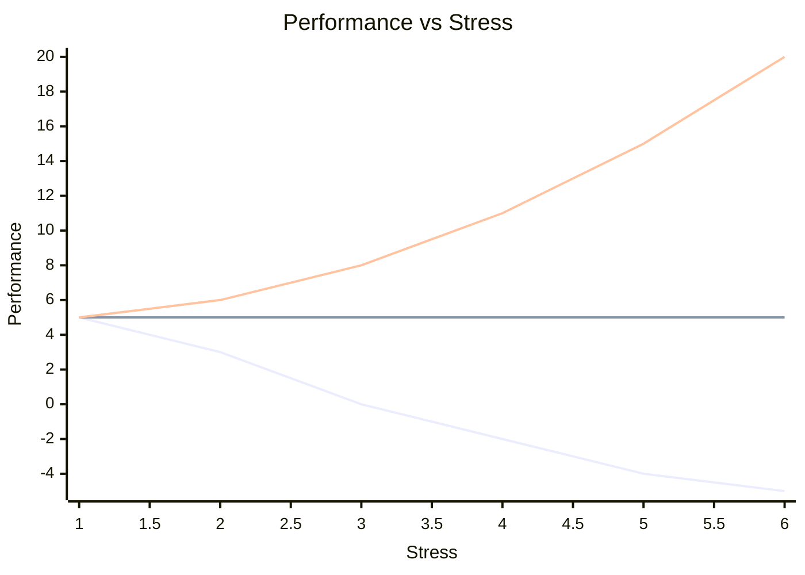

---
# You can also start simply with 'default'
theme: seriph
# random image from a curated Unsplash collection by Anthony
# like them? see https://unsplash.com/collections/94734566/slidev
background: images/appsec-background.webp
# some information about your slides (markdown enabled)
title: Coding secure
info: |
  ## Building Antifragile Applications through Secure Coding using Typescript
# apply unocss classes to the current slide
class: text-center
# https://sli.dev/features/drawing
drawings:
  persist: false
# slide transition: https://sli.dev/guide/animations.html#slide-transitions
transition: slide-left
# enable MDC Syntax: https://sli.dev/features/mdc
mdc: true
---

<div class="absolute top-5">
  <span class="font-700">
    Sten Johnsen: 
    Bouvet One - March 2025
  </span>
</div>

<div class="absolute bottom-10">
  <h1>Secure coding</h1>
  <p>Building Antifragile Applications through Secure Coding using Typescript</p>
</div>
<!--
The last comment block of each slide will be treated as slide notes. It will be visible and editable in Presenter Mode along with the slide. [Read more in the docs](https://sli.dev/guide/syntax.html#notes)
-->

---
transition: fade-out
layout: image
---

{ w-full h-auto }


---
layout: two-cols-header
transition: slide-up

---

# About me

A tech geek spending his work and spare time figuring out stuff involving electronics and software
::left::

- **Bouvet** - Since 2008, currently team-lead and (full-stack) developer

- **Experience** - Graduated 1991 - B.Eng Microelectronic computer systems. Programming since my first real job - never looked back.
- **Roles** - Programmer, project manager, program manager, department head, entrepreneur, agile coach and relationship counsellor
- **Trainer** - DevOps certification courses, Agile, Scrum
- **Busy with** - Quality of software and creating high performing teams

::right::

 {width=200px margin=30px align=right}


---
layout: two-cols-header
layoutClass: gap-16

---
# Antifragile apllicatons

::left::



::right::

**Antifragile**
- performance increases under increasing stress

**Robust**
- performance constant under increasing stress

**Fragile**
- performance reduces under stress

---


# Perimeter security


---
layout: two-cols-header
---

::left::
{ h-full w-auto }
::right::
# Secure by Design
by Dan Johnsson, Daniel Sawano, Daniel Deogun

Pocket 2019 Engelsk

Summary

Secure by Design teaches developers how to use design to drive security in software development. This book is full of patterns, best practices, and mindsets that you can directly apply to your real world development. You''ll also learn to spot weaknesses in legacy code and how to address them.
::center::

---
layout: image-right
image: public/images/Secure-Coding-Practices.jpg
transition: slide-left
---

# Traditional Application Security

- Security in separate activities
    - Threat modelling
    - Penetration tests
    - Security review
    - SAST
    - DAST

- DevOps:
    "Build Quality in" -> "Build Security in"


---
transition: slide-up
---

# Sanitizing input

## First line defence
```html
<input type="email" required pattern="^[a-zA-Z0-9._%+-]+@[a-zA-Z0-9.-]+\.[a-zA-Z]{2,}$" />
```

## Restrict input format

```ts
const sanitizeInput = (value: string) => {
  return value.replace(/[^a-zA-Z0-9 ]/g, ""); // Remove special characters
};
```

## Strong form types

```ts
interface FormData {
  name: string;
  email: string;
  age: number;
}

const [formData, setFormData] = useState<FormData>({ name: "", email: "", age: 0 });
```

---
layout: quote

---
# References

- xkcd
- Secure by Design, 
- NDC Security, Jan. 2025

---
layout: center
---
# Questions?

---
layout: center
---

# Thank You